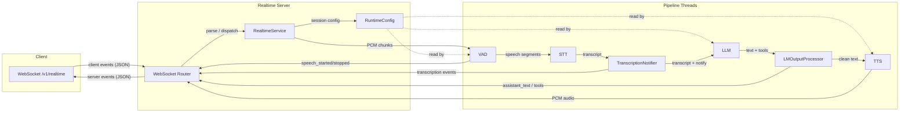
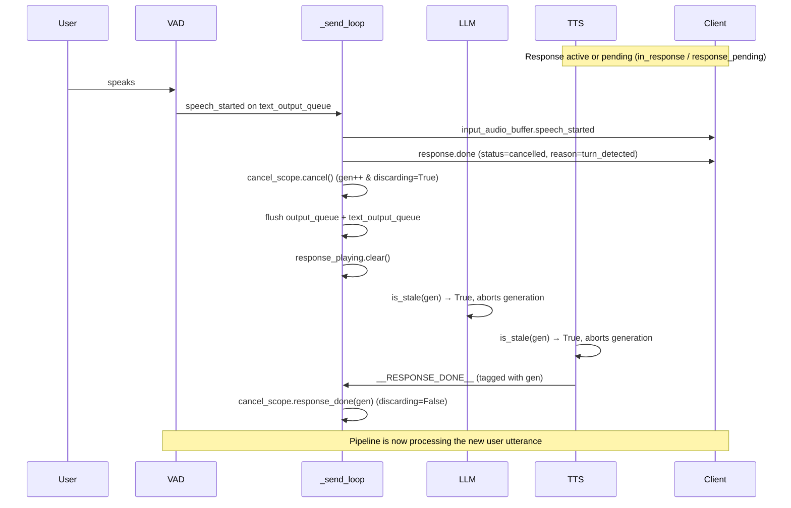

## Realtime Engine -- High-Level Architecture

The server runs as a handler thread inside the existing pipeline. A FastAPI/uvicorn instance serves the WebSocket endpoint at `/v1/realtime`, while the same queue-driven handler chain (VAD, STT, LLM, TTS) processes audio in parallel threads.



**Key flow:**

1. **Inbound audio**: Client sends `input_audio_buffer.append` with base64 PCM. `RealtimeService` decodes, resamples to 16 kHz, splits into 512-sample chunks, and puts them on the `recv_audio_chunks_queue` for VAD.
2. **Speech detection**: VAD detects speech boundaries and emits `speech_started` / `speech_stopped` events on the `text_output_queue`. Full utterance audio goes to STT.
3. **Transcription**: STT output passes through `TranscriptionNotifier`, which taps the transcript for `transcription.delta` / `transcription.completed` events before forwarding to the LLM.
4. **Generation**: The LLM generates text (and optional tool calls). `LMOutputProcessor` splits the output: clean text goes to TTS, and `assistant_text` + tool call dicts go to the `text_output_queue`.
5. **Outbound audio**: TTS writes PCM chunks to `send_audio_chunks_queue`. The router's async `_send_loop` drains both queues, encoding PCM as `response.output_audio.delta` events and translating internal messages into protocol events.
6. **Session config**: `session.update` events deep-merge into `RuntimeConfig`, which is a shared Pydantic model read by VAD (turn detection thresholds), LLM (instructions, tools), and TTS (voice) at processing time.

---

## Supported OpenAI Realtime Events

### Client -> Server

| Event | Description |
|---|---|
| `input_audio_buffer.append` | Stream base64 PCM audio. Decoded, resampled to 16 kHz, and chunked for the VAD. |
| `session.update` | Deep-merge session config (instructions, tools, voice, turn detection, audio format). |
| `conversation.item.create` | Inject `input_text` or `function_call_output` into the LLM context without triggering generation. |
| `conversation.item.delete` | Delete one exact protocol-visible user item. An input-audio item ID removes its mapped transcript and cancels only a queued or active response owned by that turn. |
| `response.create` | Trigger LLM generation. Supports per-response `instructions` and `tool_choice` overrides; rejected while any automatic or explicit response is active or pending. |
| `response.cancel` | Cancel the in-progress response and re-enable listening. |

`turn_detection.create_response` defaults to `true` when omitted or `null`.
Set it to `false` to emit and store each non-empty completed transcription without
automatically starting generation; send `response.create` when the response
should begin.

### Server -> Client

| Event | Description |
|---|---|
| `session.created` | Sent on connection with current session config. |
| `error` | Protocol errors (`session_limit_reached`, `unknown_or_invalid_event`, `invalid_session_type`, `conversation_already_has_active_response`, etc.) |
| `input_audio_buffer.speech_started` | VAD detected user speech. |
| `input_audio_buffer.speech_stopped` | End of user speech segment. |
| `conversation.item.created` | Acknowledges injected `input_text` from `conversation.item.create`. |
| `conversation.item.deleted` | Acknowledges an exact user-item deletion only after the live or compacted history no longer contains that item. |
| `conversation.item.input_audio_transcription.delta` | Streaming partial transcript (when live transcription is enabled). |
| `conversation.item.input_audio_transcription.completed` | Final transcript for the user turn (with duration usage). |
| `response.created` | Emitted before the first assistant output part or outbound audio chunk, whichever arrives first, or immediately before `response.done` for a successful zero-output response (response is `in_progress`). |
| `response.output_audio.delta` | Base64 PCM audio chunk from TTS. |
| `response.output_audio.done` | Audio stream complete for the current output item; emitted only after at least one `response.output_audio.delta`. |
| `response.output_audio_transcript.done` | Full assistant text transcript for the turn. |
| `response.function_call_arguments.done` | Tool call with `call_id`, `name`, and JSON `arguments`. |
| `response.done` | Response finished (`completed`, `cancelled` with reason `turn_detected` or `client_cancelled`). |

### Opt-in private transcript barrier

Trusted local clients that must route a completed transcript before it enters
ordinary model history can request the versioned `reachy` extension in their
first `session.update`:

```json
{
  "type": "session.update",
  "session": {
    "type": "realtime",
    "reachy_private_transcript_barrier": {
      "version": 1,
      "nonce": "<64 lowercase hexadecimal characters>"
    }
  }
}
```

The client must wait for an exact `reachy.transcript_barrier.ready` event with
the same version and nonce before sending microphone audio. In this mode the
server suppresses partial transcript events and transcript-content logs. A
non-empty final is emitted only as `reachy.transcript_barrier.completed` and is
held outside model history. While that final is pending, new audio,
`conversation.item.create`, and `response.create` fail closed.

The client must answer once with `reachy.transcript_barrier.resolve`, matching
the explicitly supplied integer version, positive integer sequence, nonce, and
input item ID; booleans, coercions, omitted fields, explicit nulls, and extra
fields are rejected. `action="accept"` must include exactly
one `msg_` user message whose sole `input_text` is byte-for-byte equal to the
pending final and whose ID has not previously resolved a private final; the
server then inserts that one message and acknowledges it as
`accepted`. `action="discard"` includes no item and scrubs the final without a
history entry. Empty or whitespace-only STT results produce a content-free
`reachy.transcript_barrier.discarded` event and require no resolution.

Any first `session.update` that contains the barrier field is privacy-sensitive
even if another field makes the update invalid: it is logged content-free,
poisons the barrier, and closes before audio is accepted. Malformed, duplicate,
overlapping, stale, or mismatched later barrier events do the same. Pending
transcript text is scrubbed on resolution, failure, and synchronously at
disconnect before handler drain.
Pending private input also freezes deferred history application and chat
compaction until exact resolution. Privacy-mode exception and content logging
remains sticky after poison until the session is unregistered, so draining work
cannot downgrade into ordinary logging. This includes an activation rejected
before `ready`: already queued audio and every later pipeline output remain
private, are scrubbed or dropped, and cannot enter history or trigger a
response while the connection closes. Parse-time and semantic client-event
failures use content-free wire errors rather than echoing client-controlled
values while that mode is active. Rejected multi-item in-band `response.input`
batches retain no accepted prefix in history. Low-level tool-parser, provider,
session-voice, WebSocket-route, and send-loop failures use the same sticky
redaction boundary. Clients that do not request this extension keep the
standard Realtime behavior described above.

### Required Home Assistant selector guard

`--require_home_assistant_guard true` is a dedicated realtime
Chat-Completions mode for trusted local clients. It marks the socket private at
connect and accepts no input before the exact first `session.update` contains a
version-1 `reachy_home_assistant_guard` request. That request carries a fresh
64-character lowercase hexadecimal nonce, the SHA-256 digest of the complete
ordered instructions-and-tools contract, and its total tool count. Every tool
must use the canonical flat Realtime function shape, names must be unique, and
the catalog must include at least one `home_assistant__*` tool. The matching
`reachy.home_assistant_guard.ready` acknowledgement is the boundary after which
audio or conversation input is accepted. The guard and private transcript
barrier may be activated atomically in the same update; their ready events are
then emitted in that order.

The acknowledged action contract cannot be replaced. Every action-capable
response uses the acknowledged instructions and tools; explicit values must
hash to that same contract, while omission inherits it. An out-of-band private
narration response is allowed only with `tool_choice="none"` and an omitted or
empty tool list. Missing, malformed, duplicate, late, or mismatched negotiation
and semantic-invalid guarded client items make the session sticky-failed and
close it without retaining an accepted action-bearing prefix. Ordinary
backends do not infer guard authority from tool names and keep their existing
behavior.

Guarded provider turns deliberately use one non-streaming Chat Completion even
when ordinary turns stream. The complete response is validated before any
history, client, TTS, or native-tool event is constructed: exactly one choice
at index 0; a matching `stop` or `tool_calls` finish reason; bounded nonempty
speech or registered calls; strict finite JSON-object arguments with unique
keys; and the effective `auto`, `required`, or `none` tool choice. A Home
Assistant selection is exactly one call with at most one short progress
sentence. Mixed, duplicate, unregistered, malformed, truncated, oversized,
JSON/code-shaped, or spoken protocol/tool-name output fails content-free and
sticky before every sink. Provider/parse/timeout failures take the same path.
Cancellation that wins before validation remains non-poisoning.

---

## Tool Calling Design

Tool calling works through two distinct paths depending on the LLM backend, but both converge to the same wire protocol for the client.

### Local LLM path (`LanguageModelHandler` -- transformers / mlx-lm)

Tools defined in `session.update` are converted to `FunctionTool` objects. Each tool's JSON Schema `parameters` are turned into a Python `inspect.Signature` (via `signature_from_schema`), and `to_code_prompt()` renders a human-readable `def name(...): """docstring"""` block.

These tool signatures are injected into the system prompt using a Jinja2 template (`tool_prompt.py`) that instructs the model to wrap tool calls in `<code>...</code>` delimiters:

```
<code>
function_name(arg_name_1=value1, arg_name_2='string_value')
</code>
```

During streaming post-processing, `LanguageModelHandler` passes each complete
tool-code block to `extract_function_calls_from_text`, which parses each
`name(kwargs)` call and validates it against registered tools. Valid calls
become `ResponseFunctionToolCall` dicts with generated `call_id`s.

Only JSON-safe literals are accepted as argument values (`None`, booleans,
integers, finite floats, strings, and lists/dicts of those with string keys), so
a parsed call can always be serialised for the wire.

Local models occasionally emit positional values despite the named-argument
instruction, for example a search tool's `query` and optional result count. The
validator recovers one or more leading values only when all of the following
hold: there is no undeclared named argument; re-parsing the original call
expression at conversion time yields exactly the same function name and ordered
parameters; every positional is a direct string or non-boolean integer literal;
and binding those values to the exact signature shown to the model introduces
no duplicate or colliding argument. The tool schema must also match a
deliberately narrow subset -- an object schema whose single required field is
its first declared property and is typed `string`, whose recovered leading
fields are typed `string` or `integer`, and whose property definitions use only
`type`, `description`, `enum`, `default`, (for arrays) `items`, and (for numeric
fields) finite, ordered `minimum`/`maximum` bounds. The object schema may contain
only `type`, `properties`, `required`, and an optional boolean
`additionalProperties`.

Anything richer -- a valid but less predictable schema, a malformed `enum`, a
second required field, a bare identifier, boolean, float, container, computed
positional, too many positionals, or a named-argument collision -- simply
declines recovery, and the call then fails closed on its missing required field.
This is not a JSON Schema validator: as with named arguments, the executing
client remains responsible for constraints such as enum membership, numeric
bounds, and patterns. Duplicate keyword names, and schema fields colliding with
the parser's reserved `__arg_N__` namespace, are rejected as ambiguous instead
of silently taking last-one-wins.

The lenient regex fallback used after a tokenizer error cannot reach recovery at
all: it re-scans output the tokenizer already rejected, so any call it recovers
that carries a positional value is dropped before conversion, while already-named
calls are kept.

### OpenAI API path (`ResponsesApiModelHandler`)

Tools are passed natively as the `tools=` parameter to `client.responses.create`. The API returns structured `function_call` items directly -- no prompt engineering or regex parsing needed. Per-response `tool_choice` overrides from `response.create` are supported.

### Common output path

Both handlers yield ordered `LLMResponseChunk.parts` containing text and tool-call
parts; the legacy `text` and `tools` fields remain compatibility views.
`LMOutputProcessor` forwards text parts to TTS and puts an `AssistantTextEvent`
with the same ordered parts on the `text_output_queue`. The router's `_send_loop`
translates these into:
- `response.output_audio_transcript.done` for the text
- `response.function_call_arguments.done` for each tool call

For audio responses, output index 0 is reserved for the continuous audio item
and tool calls use later indices. A tool-only response therefore starts its tool
indices at 1 without materialising index 0; clients must not assume output
indices are dense.

### Tool result flow

1. Client executes the tool and sends `conversation.item.create` with `type: "function_call_output"` and `output: "<result>"`
2. `RealtimeService` appends the tool output to the chat context and emits `conversation.item.created`; this does not trigger generation.
3. If the tool result needs to be spoken to the user, such as camera/search/data results, the client sends `response.create` to trigger follow-up generation.
4. For fire-and-forget robot actions such as dance, emotion, head movement, stop, or idle tools, the client can stop after `conversation.item.created`; the assistant should already have spoken the natural lead-in before the tool call.

---

## Interruption Handling

Barge-in (user speaks while the assistant is playing audio) is handled cooperatively between the VAD, the `_send_loop`, and the LLM/TTS handlers via a shared `CancelScope` object (`cancel_scope.py`).

### CancelScope design

`CancelScope` replaces the old two-signal pattern (`cancel_response` Event + `discard_stale_output` boolean) with a single object that manages:

- **Generation counter** (`cancel_scope.generation`): each response request is stamped when it enters the LLM queue, and pipeline threads carry that generation through LLM and TTS while checking `cancel_scope.is_stale(gen)` on every streaming token. When `cancel()` is called, the generation increments, so both already-running work and a prior request dequeued only afterward are stale before provider execution -- no timing games required.
- **Discard flag** (`cancel_scope.discarding`): set by `cancel()`, checked by the async `_send_loop` to drop output from superseded generations that arrives between `cancel()` and `response_done()`. Cleared by `response_done(generation)` (only when the sentinel's generation matches the discarded or current one -- sentinels from unrelated older generations are ignored), by `new_response()` on an explicit `response.create`, or by `reset()` on session claim/release.

Pipeline output is **generation-tagged**: `AudioOutput` chunks, `AssistantTextEvent`s, and response failures carry a `cancel_generation` field stamped by the handler that produced them. The send loop drops stale audio/assistant output, and the service rejects a failure that does not own the active generation. Output from the *current* generation always passes through, so a fresh response is never swallowed or failed by a superseded turn (e.g. a speculative turn whose TTS never emitted a `__RESPONSE_DONE__` sentinel).



**Step by step:**

1. **VAD detects speech**: puts a `SpeechStartedEvent` on `text_output_queue`.
2. **`_send_loop` processes text events first** (priority over audio): translates `speech_started` into protocol events. If an active response was in progress, `RealtimeService.dispatch_pipeline_event` emits `response.done` with `status="cancelled"` and `reason="turn_detected"`; it first emits `response.output_audio.done` only when at least one audio delta was sent.
3. **Cancel + queue flush**: if a response is active (`in_response`) *or* pending (`response_pending` -- accepted `response.create`, no audio yet), and interrupts are enabled (see step 4), the send loop calls `cancel_scope.cancel()` (increments generation, enables discard), clears `response_pending`, drains `output_queue` (preserving `__RESPONSE_DONE__` sentinels) and `text_output_queue` (preserving user-side events: `speech_stopped`, partial/completed transcriptions, token usage), then clears `response_playing`.
4. **Interrupt gating**: the cancel only fires if the `SpeechStartedEvent.interrupt_response` flag is set *and* the session config allows it (`turn_detection.interrupt_response`, read via `RuntimeConfig.interrupt_response_enabled`, default true). When disabled, user speech during a response is transcribed but the response keeps playing.
5. **LLM/TTS cancellation**: each response carries the generation stamped when it entered the LLM queue. Immediately before local-model/provider execution, the LLM atomically admits only that exact generation and remains visible as active until its generator exits. A local Transformers worker that survives the bounded join retains a second activation lease until the thread actually exits, and every generation owns a distinct streamer/stopping criterion, so private-barrier activation cannot race past live work or reuse its token channel. Worker exceptions are caught before Python's default thread exception hook, redacted under the same live session guard, and reduced to one content-free generation failure while waking the matching streamer. LLM and TTS also check `cancel_scope.is_stale(gen)` on every streaming token and abort early when stale.
6. **Discard guard**: while `cancel_scope.discarding` is True, the send loop drops audio chunks and assistant text whose `cancel_generation` is not current (see `_generation_is_discardable` above). The guard clears when a `__RESPONSE_DONE__` with a matching generation arrives (via `cancel_scope.response_done(gen)`), or when an explicit `response.create` starts a new response (`cancel_scope.new_response()`).
7. **Client-initiated cancel**: `response.cancel` calls `cancel_scope.cancel()` (only if a response was active), flushes both queues with the same preservation rules, triggers `finish_response(status="cancelled", reason="client_cancelled")`, re-enables `should_listen`, and clears `response_playing`.
8. **Spurious cancel safety**: if no response is active, `cancel_scope.cancel()` is not called, preventing the discard guard from being set without a `__RESPONSE_DONE__` to clear it.

---

## Testing

### Local LLM with Transformers

```bash
uv run speech-to-speech \
  --mode realtime \
  --stt parakeet-tdt \
  --llm_backend transformers \
  --tts kokoro \
  --model_name "Qwen/Qwen3-4B-Instruct-2507" \
  --llm_device mps \
  --llm_torch_dtype float16 \
  --enable_live_transcription
```

### Local LLM with MLX-LM

```bash
uv run speech-to-speech \
  --mode realtime \
  --stt parakeet-tdt \
  --llm_backend mlx-lm \
  --tts kokoro \
  --model_name "mlx-community/Qwen3-4B-Instruct-2507-bf16" \
  --llm_device mps \
  --llm_torch_dtype float16 \
  --enable_live_transcription
```

### Remote LLM with OpenAI-compatible API

```bash
uv run speech-to-speech \
  --mode realtime \
  --stt parakeet-tdt \
  --llm_backend responses-api \
  --tts kokoro \
  --model_name "openai/gpt-oss-20b:groq" \
  --responses_api_base_url "https://router.huggingface.co/v1" \
  --responses_api_api_key "$HF_TOKEN" \
  --responses_api_stream \
  --enable_live_transcription
```
